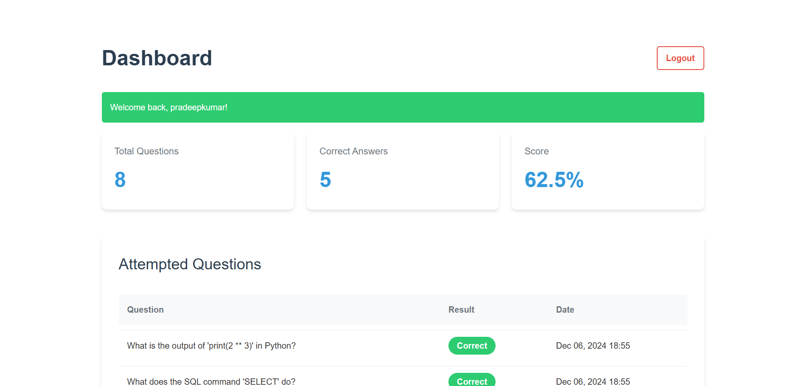

# Conceptile Intern Repository



## Local Setup Instructions

### Requirements

```Python```


### 1. Clone the Repository

To clone this repository and navigate into the folder, run the following script:

```bash
# Clone the repository
git clone https://github.com/Pradeep-Kumar-Rebbavarapu/Conceptile-Intern

# Navigate into the cloned repository folder
cd Conceptile-Intern
```

### 2. Create & Activate Virtual Environment

To create and activate a virtual environment, use the following commands:

```bash
# Create a virtual environment
python3 -m venv venv

# Activate the virtual environment

# On Windows
venv\Scripts\activate

# On macOS/Linux
source venv/bin/activate
```

### 3. Install Required Dependencies

Once the virtual environment is activated, install the required dependencies by running:

```bash
# Go Into the backend directory
cd backend

# Install dependencies from requirements.txt
pip install -r requirements.txt
```

Note: The SECRET_KEY should be kept secret and secure. The one provided here is for the sake of running the repo locally, but you should replace it with your own secret key in production.

### 4. Adding .env file

Create a .env file in the root directory of the project and add the following variables:

```bash
SECRET_KEY='django-insecure-ow2)4u=a3a@xorma)f(4!$%_6-&oy3=g97p=8rjk6=f1oh%t6a'
DEBUG=True
HOST_URL="localhost"
```

### 4. Running Database Related Commands

For setting up the database, you need to run the following commands:

```bash
# Make migrations for the database
python manage.py makemigrations

# Apply migrations to the database
python manage.py migrate

# Create a superuser to access the Django admin panel
python manage.py createsuperuser

```

### 5. Add Sample Questions to the Database

To generate and add sample questions to the database, run the following command:

```bash
# Add sample questions to the database
python manage.py generate_questions
```

### 5. Start the Server

To start the Django development server, run the following command:

```bash
# Start the Django development server
python manage.py runserver
```

Now, you can visit the project at http://localhost:8000 in your browser.

## Production Setup Instructions

### Requirements

```Python```

```Docker```

```Docker Desktop```

    
### 1. Clone the Repository

To clone this repository and navigate into the folder, run the following script:

```bash
# Clone the repository
git clone https://github.com/Pradeep-Kumar-Rebbavarapu/Conceptile-Intern

# Navigate into the cloned repository folder
cd Conceptile-Intern
```

### 2. Running Docker Container

To Build the Docker Image and Start the Docker Container:

```bash
docker-comppose up --build
```

To Run the Docker container in the background:

```bash
docker-comppose up --build -d
```

Now, you can visit the project at http://localhost in your browser.

You can Check the ip address of your network in command prompt using ```ipconfig``` or in linux using ```ifconfig```
and then you can navigate to that ip address http://<ip_address>